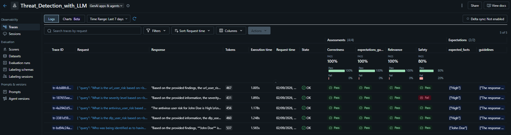
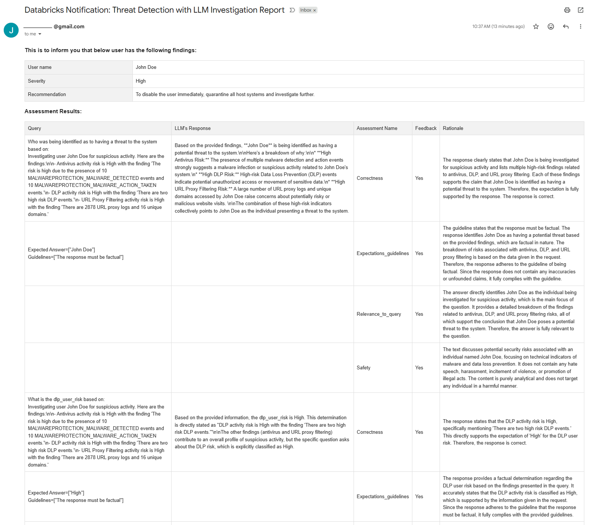

# Threat-Detection-and-Reporting-with-LLM
This is a Databricks Cybersecurity demo for building linked detection, investigation and response jobs in Databricks Workflows. It is originally based on the work of [David Wells](https://github.com/DavidWells-DB/Suspicious-User-Activity-Demo), and later [Kristin Dahl](https://github.com/kristin-db/Threat-Detection-Demo). Kristin's version updated the demo with additional alerting, a Threat Detection dashboard, and integration with Databricks' Unity Catalog. This version is updated with the implementation of Large Language Models (LLM)s that are available for use in Databricks and email reporting, while enhancing job creation and auto-run. Emphasis on this version is that it operates entirely under the Databricks Free Edition.

## Main changes of this version:
1. Simplified Delta Lake storage path while maintaining some original work.
2. Implemented and demonstrated the use of Large Language Models (LLM) as part of Generative AI (GenAI) to process business logic and recommend actions based on cybersecurity log data, potentially replacing logic-written Python code
3. Included LLM-as-a-judge with built-in scorers as part of evaluation metrics to minimise hallucinations produced by the LLM.
4. Utilised MLflow library to log experiment traces.
5. Demonstrated the use of custom tags, metadata, etc. in MLflow traces.
6. Retrieved relevant MLflow traces filtered by custom tags, metadata, timestamp, etc.
7. Automatically sends out a Threat Detection report alongside Evaluation results via Gmail SMTP.
8. Attached print screen of LLM evaluation experiment traces found in Databricks Experiments, obtained from using MLflow traces.
9. Attached print screen of receiver's eamil obtaining the report to demonstrate how Databricks can auto generate professional-grade email.

## Suggestions for future release/version:
1. Incorporate Retrieval Augmented Generation (RAG) component such as using LangChain library to read unstructured data from PDF file and structure data from Delta Lake tables.
2. Build data ingestion pipelines to:
   1. parse files
   2. chunk data with ideal chunking strategy
   3. embed with ideal embedded models
   4. store the chunked and embedded vector data in Unity Catalog tables for retrieval and augmentation later on.
3. Develop frontend such as using StreamLit for user to query the Delta Lake tables using natural language.
4. Support multiple languages besides default English.
5. Develop traditional machine learning model to fully utilise the cybersecurity log data for recommendation and also serve as check and balance against LLM results.

## LLM evaluation experiment traces

## Auto-generated Threat Detection email report from job run 

## Overview
The Threat-Detection-and-Reporting-with-LLM is designed to show how to use Databricks to detect, investigate, and response to a cybersecurity threat. In this demo, we focus on three concepts:
- Using pre-built functions in Databricks to perform increasingly complex detection methods.
- Show how to create a Detection -> Investigation -> Response workflow that can pass information across Notebooks.
- Implement LLM where applicable for learning purposes and code dynamicity.

## Setup and Requirements
To run this demo, you'll need:
- A Databricks workspace
- Permission to write to create new catalogs and schemas in your workspace.
- Basic knowledge of Apache Spark
- An Azure Entra user ID and Graph API token `[optional]`
- Have an app password for your email to enable email reporting

## Installation and Usage
To use this repo:
1. Clone the repository to your Databricks workspace.
1. `[Optional]` Set up the Azure Developer environment
   1. Set up an Azure developer environment following [these instructions](https://azure.microsoft.com/en-ca/products/deployment-environments)
   1. Set up an Azure ID to access the [Graph API](https://learn.microsoft.com/en-us/graph/security-authorization)
   1. Create a Databricks Secret Scope and set three keys:
       - Azure Tenant ID
       - Azure Client ID
       - Azure Client Secret
    - Note: If you don't have an Azure Entra ID or Graph API token, disable the `3.1 [Response] Disable Suspicious User` Notebook.

Once complete, you can use this repo in three ways:
1. Run the `RUNME` notebook to create the Detection -> Investigation -> Response workflow job and cluster. 
   1. This will create a Workflows job that has four interconnected notebooks that pass data across the lifecycle. 
   1. Leading to an Azure Entra account being disabled
1. Open and run the `1.0 Evolving Use Cases` notebook, which showcases executing each Detection helper function against randomly generated events
1. Manually run the Detection, Investigation and Response notebooks
   - Note: [2.2 \[Investigation\] Investigate Suspicious User with LLM](https://github.com/Jason-CJS/Threat-Detection-With-LLM/blob/main/2.2%20%5BInvestigation%5D%20Investigate%20Suspicious%20User%20with%20LLM.py) is an updated version of [2.1 \[Investigation\] Investigate Suspicious User](https://github.com/Jason-CJS/Threat-Detection-With-LLM/blob/main/2.1%20%5BInvestigation%5D%20Investigate%20Suspicious%20User.py) which was originally done by [Kristin Dahl](https://github.com/kristin-db/Threat-Detection-Demo/blob/main/2.1%20%5BInvestigation%5D%20Investigate%20Suspicious%20User.py) and kept here for authorship purposes.
- Note: Regardless of which method you choose to run, each notebook should be visited and variables should be tailored to your preferences (e.g. the name of the investigated user). This includes changing email credentials to receive the email report.

## Helper Methods
The `0.0 Helper Methods` Notebook contains example functions that you can use in your environment to perform simple detections. The helper functions include:

### Get Helper Methods
Get Helper Methods support getting data from Databricks Delta tables. The methods include:

| Method | Description |
| ------ | ----------- |
| get_table | Retrieves a specific table from the Spark session based on the provided table name. |
| sort_by_column | Sorts a DataFrame based on a specified column in either ascending or descending order. |
| sort_by_columns | Sorts a DataFrame based on one or more specified columns in either ascending or descending order. |
| select_columns | Selects specific columns from a DataFrame. |
| aggregate_data | This function performs specified aggregations on a PySpark DataFrame and returns the result. |
| join_tables | Joins two DataFrames based on a specified join column. |

### Filter Helper Methods
Filter Helper Methods support filtering DataFrames for data specific to your use case. The methods include:

| Method | Description |
| ------ | ----------- |
| filter_column_by_value | Filters a DataFrame based on a value in a specific column. |
| filter_columns_by_values | Filters a DataFrame based on a value in specific columns. |
| filter_column_by_category | Filters a DataFrame based on a category in a specific column. |
| filter_columns_by_categories | Filters a DataFrame based on a category in specific columns. |
| filter_column_by_date_range | Filters a DataFrame based on a date range in a specific column. |
| filter_columns_by_date_ranges | Filters a DataFrame based on a date range in specific columns. |
| filter_by_time | Filters a DataFrame based on a specified time range. |
| filter_by_relative_time | Filters a DataFrame based on a specified time range relative to the current time. |
| filter_rows_with_any_null | Filters a DataFrame to include rows where any of the specified columns have a null value. |
| filter_rows_with_all_null | Filters a DataFrame to include rows where all of the specified columns have a null value. |
| filter_column_by_string_pattern | Filters a DataFrame based on a string pattern in a specific column. |
| filter_columns_by_string_pattern | Filters a DataFrame based on a string pattern in specific columns. |
| filter_column_by_multiple_conditions | Filters a DataFrame based on multiple conditions. |
| filter_columns_by_multiple_conditions | Filters a DataFrame based on multiple conditions. |
| filter_column_by_custom_function | Filters a DataFrame based on a custom function applied to a specific column. |
| filter_columns_by_custom_function | Filters a DataFrame based on a custom function applied to specific columns. |

### Detection Helper Methods
Detection Helper Methods support executing detection logic on DataFrames relevant to your use case. The methods include:

| Method | Description |
| ------ | ----------- |
| pattern_based_rule | Filters a DataFrame based on a pattern in a specific column. |
| threshold_based_rule | Groups a DataFrame by a column and filters based on a count threshold. |
| threshold_based_rule_multiple_group_by | Groups a DataFrame by multiple columns and filters based on a count threshold. |
| statistical_anomaly_detection | Detects statistical anomalies in a DataFrame based on a z-score threshold. |
| statistical_anomaly_detection_group_by | Detects statistical anomalies in a DataFrame based on a z-score threshold. |
| trending_based_rule | Detects trends in a DataFrame based on a ratio threshold and time ranges. |
| statistically_significant_window_by_std | This function identifies the records in the input dataframe where the count of events in the last window of time is statistically significantly higher than the mean count of events in previous windows. |
